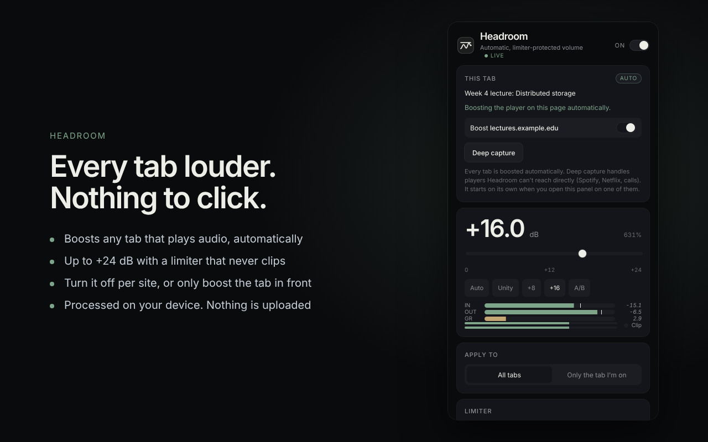

# Headroom

Automatic, limiter-protected volume boost for every Chrome tab. Audio stays on your device.

- **Automatic:** any tab that plays audio or video is boosted the moment it starts. Nothing to click.
- **Up to +24 dB** with a limiter that keeps the output below 0 dBFS, so it never clips.
- **Three limiter styles:** Transparent, Balanced and Night.
- **Per-site switch:** turn the boost off for any website.
- **"Only the tab I'm on"** mode, if you prefer it.
- **Deep capture** for players the page boost can't reach (Spotify, Netflix, web calls): open the popup on that tab, or press `Alt+Shift+B`.

## Install

1. **[Download headroom.zip](https://github.com/muamerarifi-pixel/headroom.volumebooster/releases/latest/download/headroom.zip)** and unzip it. You get a folder named `headroom`.
2. Move that folder somewhere permanent (for example `Documents/Extensions/headroom`). Chrome loads the extension from this folder, so don't delete it.
3. Open `chrome://extensions` and turn on **Developer mode** (top right).
4. Click **Load unpacked** and select the `headroom` folder (the one that contains `manifest.json`).

Works in Chrome, Edge, Brave and Opera (version 116 or newer).

## Update

Download [headroom.zip](https://github.com/muamerarifi-pixel/headroom.volumebooster/releases/latest/download/headroom.zip) again, replace the files in your folder, then click the reload ↻ icon on Headroom's card in `chrome://extensions`.

## Shortcuts

| Shortcut | Action |
|---|---|
| `Alt+Shift+H` | Turn Headroom on or off |
| `Alt+Shift+B` | Deep-capture the current tab (press again to stop) |

Change them at `chrome://extensions/shortcuts`.

## Privacy

All audio is processed locally in your browser. Headroom has no servers, no analytics and no accounts. Nothing is recorded or uploaded.
